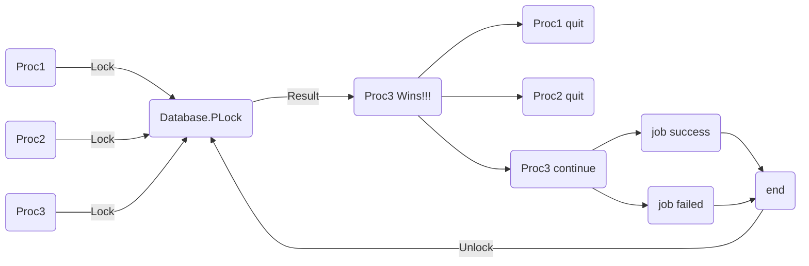

> 在并发场景中，我们经常使用锁来解决数据的共享问题，但语言标准库中的锁往往只能应用于单机的场景，因为多实例部署的场景下，一个实例并不能获取到另一个实例内存中构建的锁。


## 分布式锁

简单来说，分布式锁一般会额外引入一个“中心化的节点”，让所有服务实例都向它请求锁，这样一来实例与实例之间就能通过这个中心化的节点来进行通信了。

上面提到的“中心化节点”的选型有很多种选择，在业内比较常见的有 Redis / ZooKeeper / 数据库等，本文介绍一种基于数据库的分布式锁设计，数据库本身的选型没有标准的答案，理论上来说只要支持唯一索引（Unique Index）的数据库都符合选型标准，例如常见的 MySQL 和 MongoDB。

为什么需要唯一索引？因为支持了唯一索引的数据库都具备以下的能力（不考虑硬件故障等意外情况）：

<u>**多个并发请求同时向数据库插入唯一键相同的记录时，只有一个请求能够成功。**</u>并且失败的请求往往能够识别出失败的原因是来自竞争，例如 `Duplicate Key Error`。

可以看到，唯一索引的表现和语言标准库中的锁非常一致。


## 数据库表结构设计

```go
type PLock struct {
	ID       string // 数据库主键
	Key      string // 锁定的 key, 与 BizType 组成 uniq key
	Val      string // 锁的 value, 可以是业务相关的自定义数据
	BizType  string // 锁的类型, 与 Key 组成 uniq key
	ExpireAt int64  // 过期时间
}
```

这里为了阅读体验，我们将数据库表结构设计的尽量精简，实际情况中可以根据业务需要自行修改表结构。

上面可以看出，我们使用 `BizType` 和 `Key` 组成了一个唯一索引 `(BizType, Key)`，然后添加了两个额外的字段 `Val` / `ExpireAt` 来存储锁的额外信息。


## 加解锁流程设计

有了基本的表结构后，我们接下来需要考虑如何基于这张表来实现加解锁的流程。我们在开始前不妨先思考清楚我们想要实现的功能是什么，从业务的角度出发不难得到下面的流程图：



可以看到，我们至少需要两个接口：`Lock` / `Unlock`，同时，为了实现一个比较完备的组件，我们在运行过程中可能还需要获取一些别的信息，最终我们将一个“选举器”整理为如下的接口：

```go
// Elect, 选举器接口, 确保多实例部署情况下在同一时刻, 同一 key 只有一个实例在运行对应任务
type Elect interface {
	// Lock, 锁定 key 并运行 cb, 通过 cb 传入的 context 可以用于监听任务的取消信号
	// 因此 cb 内部实现应当处理 ctx.Done() 信号, 以便在任务取消时及时退出
	// 仅当锁定成功时, 才会运行 cb 并返回 true
	// 其余情况均返回 false, 如有错误, 则返回错误
	Lock(key string, cb func(ctx context.Context)) (ok bool, err error)

	// Unlock, 解锁 key 并取消运行中的任务
	Unlock(key string) (err error)

	// HoldingKeys, 返回当前持有的所有 key
	HoldingKeys() []string

	// LockedKeys, 返回当前被锁定的所有 key
	// 注意和 HoldingKeys 的区别, HoldingKeys 只返回当前实例持有的 key,
	// 而 LockedKeys 返回所有实例持有的 key, 一般从数据库中查询得知
	LockedKeys() ([]string, error)

	// Close 优雅退出
	Close()
}
```

接口定义的方法也比较简洁，需要实现的具体功能见代码的注释即可。

但是我们不难发现，接口内定义的方法似乎没有覆盖到 `PLock` 表中全部的字段，尤其是唯一键中的 `BizType`—— 这里稍微解释一下，我个人的编码习惯会将其放入到实现类中去，这里给出一个基于 MongoDB 的实现：

```go
// mongoElect, 基于 MongoDB 的 Elect 实现, 字段含义见 MongoElectConfig
type mongoElect struct {
	bizType                          mongodb.PLockBizType
	holder                           string
	holdDuration                     time.Duration
	refreshInterval, refreshDuration time.Duration

	mu           *sync.RWMutex
	runningTasks map[string]*lockedTask // key: lock key, value: locked task

	logger *logrus.Entry
}

type MongoElectConfig struct {
	// BizType 业务类型
	BizType mongodb.PLockBizType

	// Holder 锁的持有者名称, 例如: 服务实例 ID
	Holder string

	// HoldDuration 初始锁的持有时间, 例如: 任务执行时间
	HoldDuration time.Duration

	// RefreshInterval 锁的续期间隔, 例如: 任务执行时间的 1/3
	RefreshInterval time.Duration

	// RefreshDuration 锁的续期时间(以 now 为标准), 至少为 RefreshInterval 的 2 倍
	RefreshDuration time.Duration
}

func NewMongoElect(conf *MongoElectConfig) Elect {
	if conf == nil {
		panic("conf must not be nil")
	}
	if conf.BizType == "" {
		panic("bizType must not be empty")
	}
	if conf.Holder == "" {
		panic("holder must not be empty")
	}
	if conf.HoldDuration <= 0 {
		panic("holdDuration must be positive")
	}
	if conf.RefreshInterval <= 0 {
		panic("refreshInterval must be positive")
	}
	if conf.RefreshDuration <= 0 {
		panic("refreshDuration must be positive")
	}
	if conf.RefreshDuration < conf.RefreshInterval*2 {
		panic("refreshDuration must be greater than 2 * refreshInterval")
	}
	return &mongoElect{
		bizType:         conf.BizType,
		holder:          conf.Holder,
		holdDuration:    conf.HoldDuration,
		refreshInterval: conf.RefreshInterval,
		refreshDuration: conf.RefreshDuration,
		mu:              new(sync.RWMutex),
		runningTasks:    make(map[string]*lockedTask),
		logger: logrus.WithFields(logrus.Fields{
			"bizType":      conf.BizType,
			"holder":       conf.Holder,
			"holdDuration": conf.HoldDuration,
			"refresh":      fmt.Sprintf("%v/%v", conf.RefreshInterval, conf.RefreshDuration),
			"module":       "mongo_elect",
		}),
	}
}
```

上面这个实现类实现的具体功能是：加锁时，初始设置好锁的过期时间为 `HoldDuration`，如果加锁成功，则开始运行任务，运行过程中每经过 `RefreshInterval` 的间隔，就把锁的过期时间延长为 `time.Now + RefreshDuration`，直到任务结束为止。

通过这种设计，我们可以“大致”保证<u>**在任务完成之前锁不会过期**</u>，因为我们会不断的进行 refresh 操作来延长锁的持有时间。当然如果想要让程序健壮地达到这个目标，我们需要引入更多的复杂性，仅仅依赖一个结构体的字段定义是不足以实现的。

接下来，我们开始实现加解锁的流程（接口中的其他方法比较简单，略过）：

```go
func (e *mongoElect) Lock(key string, cb func(context.Context)) (ok bool, err error) {
	e.mu.Lock()
	defer e.mu.Unlock()

	// 锁定成功后, 运行任务
	defer func() {
		if ok {
			e.logger.Infof("[Lock] elect success, key: %v", key)
			task := e.runningTasks[key]
			if task == nil {
				panic("[Lock] task not found after lock")
			}
			e.runTask(task, cb)
		}
	}()

	// 预查询目标锁
	lock, err := mongodb.PLockDAL.QueryByUniqKey(key, e.bizType)
	if err != nil {
		e.logger.WithError(err).Error("[Lock] elect failed with query error")
		return
	}

	// 目标锁不存在, 尝试创建
	if lock == nil {
		isDup, err := e.createLock(key)
		return err == nil && !isDup, err
	}

	// 目标锁存在, 但已过期, 精确删除该锁后再尝试创建
	if lock.ExpireAt < common.Millisec(time.Now()) {
		e.logger.Warnf("[Lock] elect for an expired lock, try delete it, key: %v, lock: %v", key, lock)
		if err = mongodb.PLockDAL.DeleteByID(lock.ID); err != nil {
			e.logger.WithError(err).Error("[Lock] elect failed with delete error")
			return
		}
		isDup, err := e.createLock(key)
		return err == nil && !isDup, err
	}

	// 锁是自己创建的, 报错提示
	if lock.Value == e.holder {
		return false, fmt.Errorf("lock of %s already owned", key)
	}

	// 锁不是自己创建的, 返回失败
	e.logger.WithFields(logrus.Fields{
		"key":  key,
		"lock": lock,
	}).Warn("[Lock] elect failed for already locked")

	return false, nil
}

func (e *mongoElect) createLock(key string) (dup bool, err error) {
	expireAt := common.Millisec(time.Now().Add(e.holdDuration))
	id, isDup, err := mongodb.PLockDAL.Create(key, e.holder, e.bizType, expireAt)
	e.logger.Infof("[createLock] elect result, key: %v, id: %v, err: %v", key, id, err)
	if err != nil {
		return false, err
	}

	if isDup {
		e.logger.Warnf("[createLock] elect failed for already locked, key: %v", key)
		return true, nil
	}

	if id == nil {
		err = fmt.Errorf("[createLock] elect failed for missing lock id, key: %v", key)
		e.logger.WithError(err).Error("Unknown error")
		return
	}

	// 成功创建锁, 记录任务
	task := defaultLockedTask(key)
	task.lockID = *id
	e.runningTasks[key] = task

	return
}

func (e *mongoElect) runTask(task *lockedTask, cb func(context.Context)) {
	refreshFn := func() {
		ticker := time.NewTicker(e.refreshInterval)
		lockID := task.lockID.(primitive.ObjectID)
		logger := e.logger.WithField("lockID", lockID.String())

		for {
			select {
			case <-task.canceled():
				e.logger.Info("[refreshFn] refresh lock canceled")
				ticker.Stop()
				e.safeCancelTask(task)
				return

			case <-ticker.C:
				// 查询锁
				var lock *mongodb.PLock
				for {
					var err error
					lock, err = mongodb.PLockDAL.QueryByID(lockID)
					if err != nil {
						logger.WithError(err).Error("[refreshFn] refresh lock failed with query error")
						time.Sleep(time.Second)
						continue
					}
					break
				}

				nowTs := common.Millisec(time.Now())

				// 锁不存在, 异常情况, 直接退出
				// 或者续期不及时, 已被其他实例抢占
				if lock == nil || lock.ExpireAt < nowTs {
					logger.Errorf("[refreshFn] refresh lock failed for lock not found, maybe released")
					e.safeCancelTask(task)
					return
				}

				// 正常续期
				expireAt := common.Millisec(time.Now().Add(e.refreshDuration))
				e.logger.Infof("[refreshFn] refresh lock start, new expireAt: %v", expireAt)
				if err := mongodb.PLockDAL.UpdateExpireAtByID(lockID, expireAt); err != nil {
					logger.WithError(err).Error("[refreshFn] refresh lock failed with update error")
					// 如果续期失败, 且距离过期时间不足 2 倍的 refresh interval, 则直接退出
					// 否则可能导致锁过期时, 任务还在执行
					// 其余情况暂时不管, 会在下次续期时重试
					if lock.ExpireAt-nowTs < e.refreshInterval.Milliseconds()*2 {
						logger.Error("[refreshFn] refresh lock failed for too late")
						e.safeCancelTask(task)
						return
					}
				}
				e.logger.Infof("[refreshFn] refresh lock success, new expireAt: %v", expireAt)
			}
		}
	}

	task.run(cb, refreshFn)
}

func (e *mongoElect) safeCancelTask(task *lockedTask) {
	e.mu.Lock()
	defer e.mu.Unlock()
	e.cancelTask(task)
}

// WARN: 该方法需要在持有锁的情况下调用
func (e *mongoElect) cancelTask(task *lockedTask) {
	// 先取消任务
	task.cancelAndWait()
	lockID := task.lockID.(primitive.ObjectID)

	// 再删除 db 锁, 重试直到成功
	common.WithRetry(func() error {
		if err := mongodb.PLockDAL.DeleteByID(lockID); err != nil {
			e.logger.WithError(err).Error("[cancelTask] cancel task failed with delete error")
			return err
		}
		return nil
	}, -1, time.Second)

	// 最后删除任务
	delete(e.runningTasks, task.key())
}
```

上面的代码比较长，我们逐步进行解释（注，本文将省略数据库层面的代码）：

1. 加锁时，首先查询想要锁的唯一键是否存在
    1. 如果不存在，则直接进行加锁即可（可能会由于竞争而加锁失败）
    2. 如果存在，到 2
2. 目标锁存在，进一步检查其是否过期
    1. 如果过期了，则通过 id 字段精确删除这条锁记录后，再尝试创建
    2. 如果没有过期，是一把正常的锁，到 3
3. 目标锁正常，进一步检查这把锁的持有人是谁
    1. 如果是自己，则报错，这里我们暂不支持可重入
    2. 如果不是自己，也报错，说明加锁失败的原因

最后，我们回到开头就写好的 `defer` 函数，如果最终加锁的结果是成功的，则开始运行 `cb` 函数，上面代码中使用了一个封装好的 `lockedTask` 类型，具体实现我们放在下文展示，这里先继续关注运行的流程。


---


可以看到，在 `runTask` 函数中，我们定义了一个 `refreshFn` 用于刷新锁的有效期，然后将这个 `refreshFn` 和业务的 `cb` 一起运行了，这里我们聚焦到刷新的逻辑上：

1. 监听 task 的退出信号

    1. 如果退出了，说明 task 以及不再运行了，直接返回即可（当然我们冗余调用了一次 `safeCancelTask`，目的主要是将 task 从结构体维护的 `runningTask` 中清理出去）
    2. 如果没有退出，则到 2

2. 监听 ticker

    前面我们提到了，我们的设计是每经过 A 时间，就续期 B 时间，所以依赖一个 ticker 来实现 A 的逻辑。

    续期的逻辑如下：

    a. 查询持有的锁记录，不存在或过期则直接调用 `safeCancelTask` 退出。（事实上，这种情况理论上不应存在，除非前置的查询由于 db 的问题不断重试，但为了以防万一还是写上了这段兜底的代码，具体原因见 b）

    b. 锁存在且未过期的情况下，我们调用 Update 函数进行续期，失败时如下处理：

    ​	b.1. 如果 Update 失败，且锁的过期时间小于当前时间 + 2 倍的续期间隔，则直接中断

    ​	b.2. 否则暂时忽略，等待下一次续期重试

    看到这里，我们应该能明白，为什么说续期时理论上不会发生锁记录不存在或锁过期的情况了，因为在续期过程中，即使续期的 Update 行为发生了错误，我们也会妥善的进行处理 —— 一旦发现锁临近过期，我们就会立即终止任务，防范于未然；如果锁过期时间较为久远，则容忍本次失败。

    

---


接下来看一看解锁的实现：

```go
func (e *mongoElect) Unlock(key string) error {
	e.mu.Lock()
	defer e.mu.Unlock()

	task, ok := e.runningTasks[key]
	if !ok {
		return fmt.Errorf("lock of %s not owned", key)
	}

	e.cancelTask(task)
	return nil
}
```

有了加锁的底子，解锁实现起来就比较简单了，只需要调用 `cancelTask` 方法即可。


---


附：lockedTask 具体实现

```go
type lockedTask struct {
	ctx    context.Context
	cancel context.CancelFunc

	lockKey string
	lockID  any

	doneCh  chan struct{}
	runOnce *sync.Once
}

func defaultLockedTask(key string) *lockedTask {
	ctx, cancel := context.WithCancel(context.Background())
	return &lockedTask{
		ctx:     ctx,
		cancel:  cancel,
		lockKey: key,
		doneCh:  make(chan struct{}),
		runOnce: new(sync.Once),
	}
}

func (lt *lockedTask) run(cb func(context.Context), refresh func()) {
	lt.runOnce.Do(func() {
		// 后台运行任务
		go func() {
			cb(lt.ctx)
			close(lt.doneCh)
			lt.cancel()
			log.WithFields(logrus.Fields{
				"lockKey": lt.lockKey,
				"lockID":  lt.lockID,
			}).Info("locked task done")
		}()

		// 后台刷新锁有效期
		go refresh()
	})
}

func (lt *lockedTask) cancelAndWait() {
	lt.cancel()
	<-lt.doneCh
}

func (lt *lockedTask) canceled() <-chan struct{} {
	return lt.ctx.Done()
}

func (lt *lockedTask) key() string {
	return lt.lockKey
}
```

不难看出，`lockedTask` 类型主要是封装了业务任务的执行流程，为其添加了基于 `context.Context` 的中断控制以及刷新锁的有效期的方法。


---


最终我们得到的选举器的工作过程大致如下图所示：


## 结尾

结束了吗？还没有，即使我们实现了一个 `Elect` 接口，我们仍需要考虑一个问题：调用方应该怎样合理的进行调用？

我在实际工作中遇到过这样的需求：一个服务的多实例同时启动后，均匀的让每个实例处理同一个类型的不同任务。比如说，这个服务需要订阅 100 个消息队列的 topic，我将部署 10 台实例，在他们启动后，让这 100 个订阅任务均匀的分配到这些实例上去。

此时，我们在应用层也有许多工作要做，例如：

1. 限制每个实例最多处理的任务数量，在本例中可以是 20 （此时允许有 5 台实例挂掉，剩下 5 台实例可以接管）。
2. 启动异步的监控协程，监控有哪些任务没有实例在处理，一旦发现则尝试抢占对应任务的锁并接管。

总而言之，本文实现了一个与业务无关的中间组件，目的是向大家展示分布式系统下复杂的情况以及我们可能的处理方式，希望能对读者有所启发。

如何将程序写得更为健壮一直是计算机领域内的一大难题，我们可以针对不同的场景对其需要的健壮性进行合理评估。对于很多不重要的场景而言，将代码实现得无比健壮也许是浪费时间的，例如，我也会在很多场景下简单地使用 redis 中的 `set nx ex` 指令来充当一个简单的分布式锁，但对于很多重要的场景而言（例如银行、电商），这种方式往往都是不可取的。
